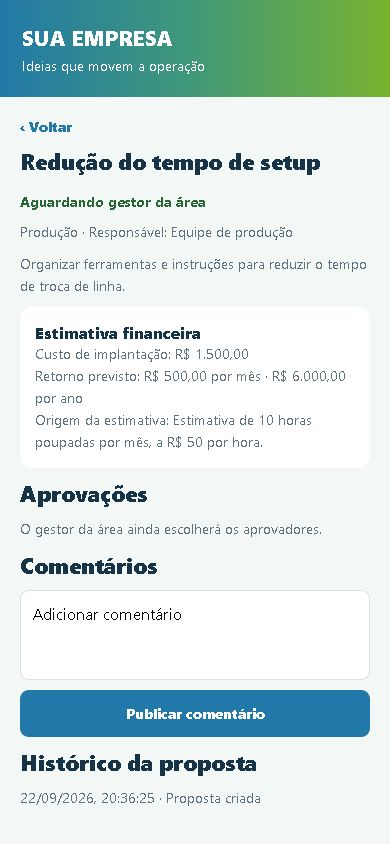
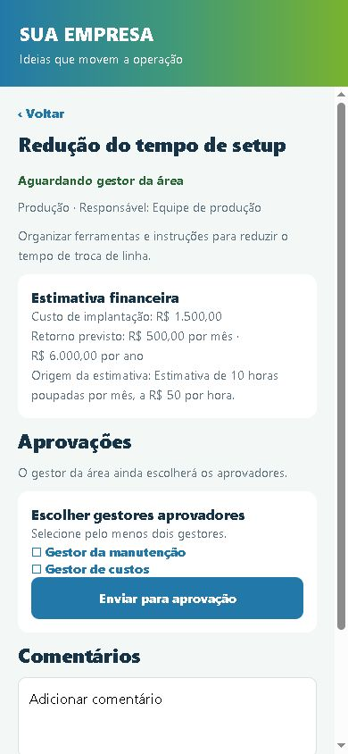
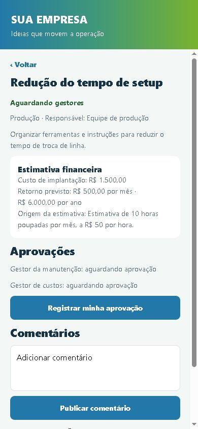

# "Sua empresa" Painel de Melhorias

Modelo de aplicativo para registrar ideias de melhoria e acompanhar propostas. Ele pode ser usado para uma demonstração offline em um celular ou conectado ao Firebase de qualquer empresa.

## Modos disponíveis

No modo **offline**, os dados ficam no próprio aparelho. Ele é indicado para demonstrações e testes rápidos. Os acessos de exemplo são: colaborador `000000`, gestor da área `111111`, gestor da manutenção `222222` e gestor de custos `333333`. Essas senhas são apenas para apresentação, não para uso na empresa.

No modo **conectado**, cada pessoa entra com uma conta própria criada pela empresa. O código não inclui contas nem senhas de colaboradores reais. As propostas e comentários são sincronizados pelo Firebase em tempo real. Esse é o modo adequado para uso dentro de uma empresa.

## Recursos

Cada proposta registra custo de implantação, retorno esperado, período mensal ou anual e uma explicação para a estimativa. O aplicativo apresenta o retorno nos dois períodos para facilitar a comparação. O gestor da área escolhe de dois a cinco gestores aprovadores; cada um usa a própria conta e registra sua decisão. A execução só pode começar depois de todas as aprovações. Colaboradores podem criar propostas e comentar; o gestor da área acompanha a execução, conclui ou registra a não conclusão com motivo. Propostas excluídas e o histórico geral ficam restritos aos gestores da área.

As permissões são aplicadas nas regras do Firestore, não somente na tela do aplicativo.

## Aplicativo em funcionamento

Estas são capturas atuais do modo offline, aberto no navegador com a tela ajustada para 390 × 844 pixels. A proposta exibida foi criada apenas para mostrar o fluxo nas imagens; o aplicativo de demonstração distribuído continua sem propostas preenchidas.

| Acesso à demonstração | Painel do colaborador | Cadastro da proposta |
| --- | --- | --- |
|  |  |  |

| Resumo financeiro | Escolha dos gestores | Aprovação individual |
| --- | --- | --- |
|  |  |  |

[Veja também a proposta aguardando análise e as aprovações pendentes](assets/screenshots/).

As imagens mostram a interface em tamanho de celular, mas não são capturas de um APK instalado no Android.

## Testar no computador

```bat
npm ci
set EXPO_PUBLIC_APP_MODE=offline
npm start
```

Para usar o modo conectado, copie `.env.example` para `.env`, preencha os valores Firebase e execute:

```bat
set EXPO_PUBLIC_APP_MODE=firebase
npm start
```

Para conferir o código:

```bat
npm run check
```

## Gerar APK

Vincule o projeto à sua conta Expo/EAS:

```bat
npx eas-cli login
npx eas-cli build:configure
```

APK offline para demonstração:

```bat
npx eas-cli build --platform android --profile offline
```

APK conectado para teste interno, depois de configurar `EXPO_PUBLIC_FIREBASE_*` no ambiente `preview` da EAS:

```bat
npx eas-cli build --platform android --profile preview
```

O perfil `production` gera AAB para distribuição por loja. Caso não tenha Git instalado, execute `set EAS_NO_VCS=1` na mesma janela antes do build.

## Firebase

O guia de implantação está em [docs/IMPLANTACAO-FIREBASE.md](docs/IMPLANTACAO-FIREBASE.md). Ele orienta a criação do projeto, contas de usuários, perfis, regras, testes e distribuição.

O código traz o fluxo atualizado, mas a instalação conectada não fica pronta apenas ao baixar o repositório. A empresa precisa configurar seu projeto Firebase, criar as contas, publicar as regras, vincular a própria conta Expo/EAS, gerar o APK e validar o funcionamento em aparelhos reais. Contas corporativas existentes não entram automaticamente: a versão atual utiliza o login de e-mail e senha do Firebase.

Antes de distribuir, troque o nome, o identificador Android e os arquivos de `assets/` pelos materiais aprovados pela empresa. O ícone atual é apenas um exemplo visual e não concede direito de uso de marcas de terceiros.


