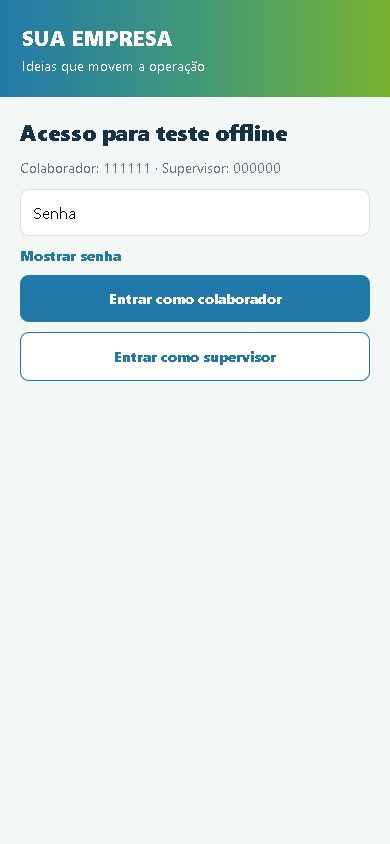
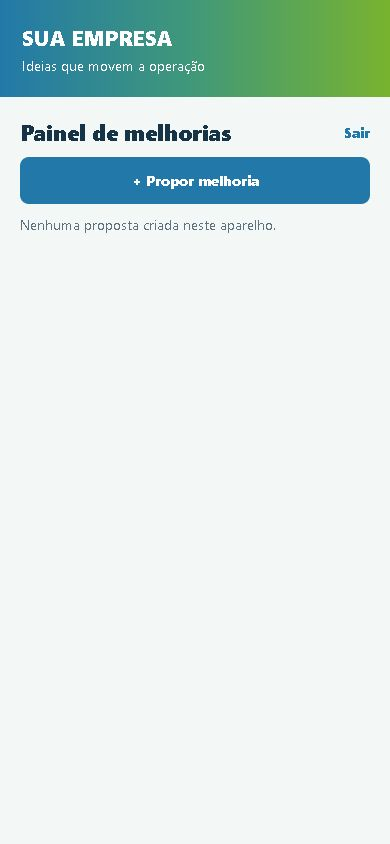
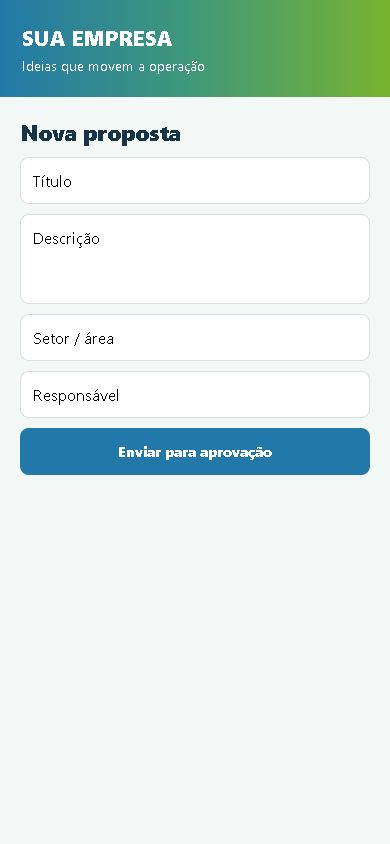
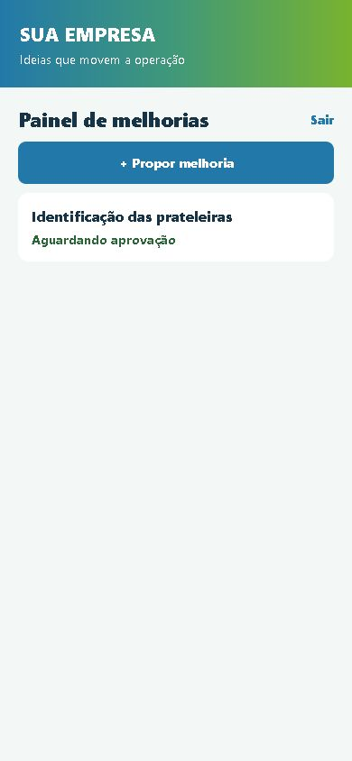
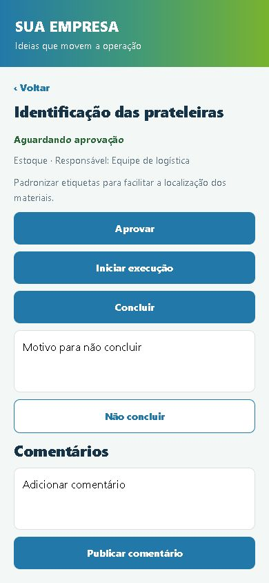

# "Sua empresa" Painel de Melhorias

Modelo de aplicativo para registrar ideias de melhoria e acompanhar propostas. Ele pode ser usado para uma demonstração offline em um celular ou conectado ao Firebase de qualquer empresa.

## Modos disponíveis

No modo **offline**, os dados ficam no próprio aparelho. Ele é indicado para demonstrações e testes rápidos. A senha de colaborador é `111111`; a senha de supervisor é `000000`.

No modo **conectado**, cada pessoa entra com uma conta própria. As propostas e comentários são sincronizados pelo Firebase em tempo real. Esse é o modo adequado para uso dentro de uma empresa.

## Recursos

Colaboradores podem criar propostas, comentar e consultar o histórico das propostas ativas. Supervisores podem aprovar, rejeitar, iniciar a execução, concluir, registrar uma não conclusão com motivo e excluir da lista principal. O motivo fica visível para a equipe. Propostas excluídas e o histórico geral ficam restritos a supervisores.

As permissões são aplicadas nas regras do Firestore, não somente na tela do aplicativo.

## Aplicativo em funcionamento

Estas são capturas reais do modo offline aberto no navegador, com a tela ajustada para 390 × 844 pixels. A proposta exibida foi criada apenas para as capturas; o aplicativo de demonstração continua sem propostas preenchidas.

| Acesso | Painel do colaborador | Nova proposta |
| --- | --- | --- |
|  |  |  |

| Proposta aguardando análise | Ações do supervisor |
| --- | --- |
|  |  |

As imagens mostram a interface em tamanho de celular, mas não são capturas de um APK instalado no Android.

## Testar no computador

```bat
npm ci
set EXPO_PUBLIC_APP_MODE=offline
npm start
```

Para usar o modo conectado, copie `.env.example` para `.env`, preencha os valores Firebase e execute:

```bat
set EXPO_PUBLIC_APP_MODE=firebase
npm start
```

Para conferir o código:

```bat
npm run check
```

## Gerar APK

Vincule o projeto à sua conta Expo/EAS:

```bat
npx eas-cli login
npx eas-cli build:configure
```

APK offline para demonstração:

```bat
npx eas-cli build --platform android --profile offline
```

APK conectado para teste interno, depois de configurar `EXPO_PUBLIC_FIREBASE_*` no ambiente `preview` da EAS:

```bat
npx eas-cli build --platform android --profile preview
```

O perfil `production` gera AAB para distribuição por loja. Caso não tenha Git instalado, execute `set EAS_NO_VCS=1` na mesma janela antes do build.

## Firebase

O guia de implantação está em [docs/IMPLANTACAO-FIREBASE.md](docs/IMPLANTACAO-FIREBASE.md). Ele orienta a criação do projeto, contas de usuários, perfis, regras, testes e distribuição.

Antes de distribuir, troque o nome, o identificador Android e os arquivos de `assets/` pelos materiais aprovados pela empresa. O ícone atual é apenas um exemplo visual e não concede direito de uso de marcas de terceiros.


