# "Sua empresa" Painel de Melhorias

Modelo de aplicativo para registrar ideias de melhoria e acompanhar propostas. Ele pode ser usado para uma demonstração offline em um celular ou conectado ao Firebase de qualquer empresa.

## Modos disponíveis

No modo **offline**, os dados ficam no próprio aparelho. Ele é indicado para demonstrações e testes rápidos. Os acessos de exemplo são: colaborador `000000`, gestor da área `111111`, gestor da manutenção `222222` e gestor de custos `333333`. Essas senhas são apenas para apresentação, não para uso na empresa.

No modo **conectado**, cada pessoa entra com uma conta própria criada pela empresa. O código não inclui contas nem senhas de colaboradores reais. As propostas e comentários são sincronizados pelo Firebase em tempo real. Esse é o modo adequado para uso dentro de uma empresa.

## Recursos

Cada proposta registra custo de implantação, retorno esperado, período mensal ou anual e uma explicação para a estimativa. Os valores são digitados em reais, somente com números e sem centavos. O aplicativo apresenta o retorno nos dois períodos para facilitar a comparação. Um gestor escolhe de dois a cinco aprovadores ou não aprova a proposta antes dessa escolha. Cada aprovador usa a própria conta e pode aprovar sem publicar comentário. Após a última aprovação, a proposta passa automaticamente para **Em andamento**. Somente quem criou a proposta pode concluí-la ou excluí-la. Os gestores podem registrar a não conclusão com motivo. Propostas excluídas e o histórico geral ficam restritos aos gestores. O painel mostra um gráfico simples com os totais por situação.

Na demonstração offline, a tela informa que os dados não são sincronizados. O perfil é escolhido antes da senha. Esta versão começa sem propostas de demonstração; propostas de testes antigos ficam fora da lista atual. Ao sair de **Nova proposta**, o formulário é limpo. No Firebase, a seleção de gestores é feita por busca da matrícula cadastrada pela TI. O login conectado, porém, ainda é por e-mail e senha; acesso com matrícula e senha da empresa exigirá integração específica da TI.

As permissões são aplicadas nas regras do Firestore, não somente na tela do aplicativo.

## Aplicativo em funcionamento

Estas imagens foram feitas agora, com a versão atual do aplicativo aberta no navegador em uma tela de 390 × 844 pixels. Criei uma proposta de exemplo somente para mostrar o caminho completo; ao instalar o aplicativo para começar os testes, ele não vem com essa proposta cadastrada.

| Escolha do perfil | Senha de demonstração | Painel e andamento |
| --- | --- | --- |
| 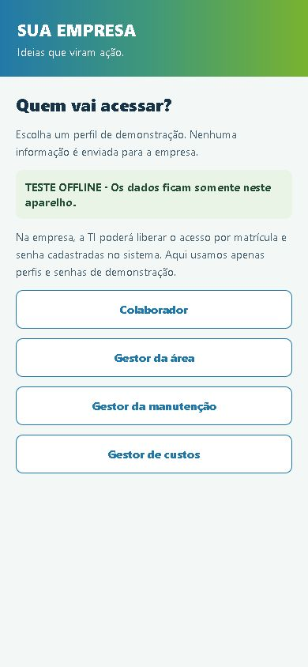 | 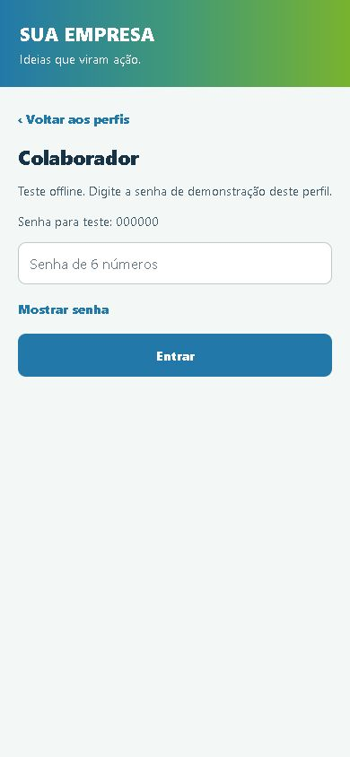 | 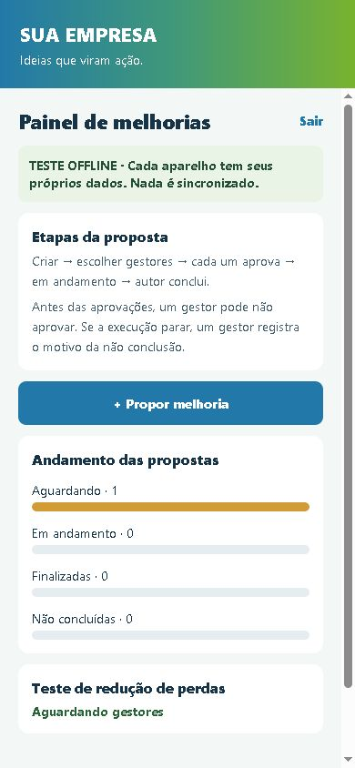 |

| Nova proposta | Custo e retorno | Etapas da decisão |
| --- | --- | --- |
| 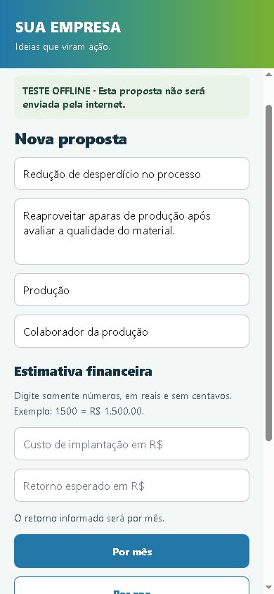 | 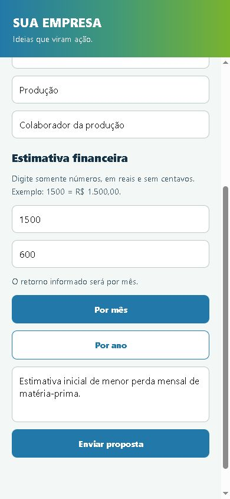 | 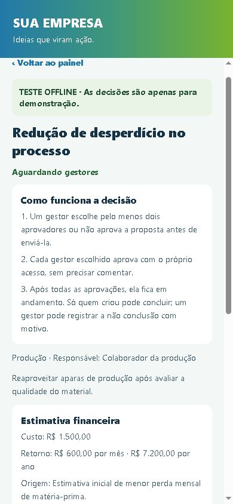 |

| Ações do autor | Escolha dos gestores | Aprovação individual |
| --- | --- | --- |
| 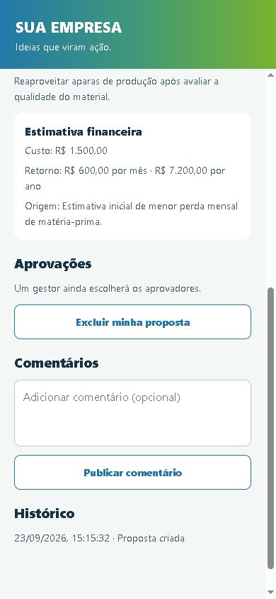 | 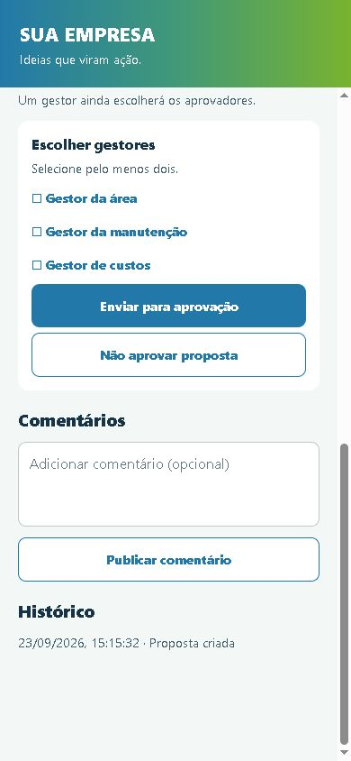 | 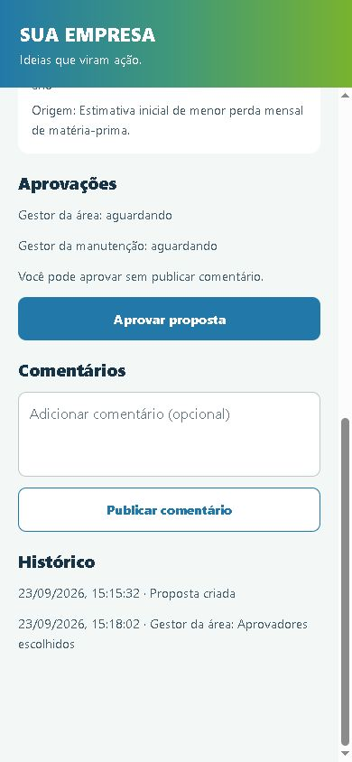 |

| Em andamento | Conclusão pelo autor | Painel após a conclusão |
| --- | --- | --- |
| 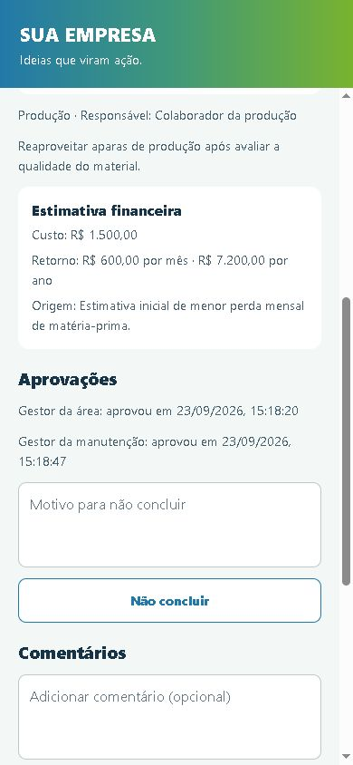 | 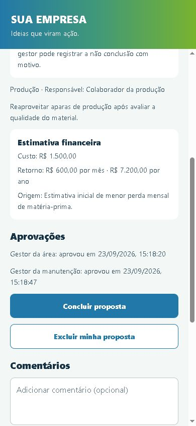 | 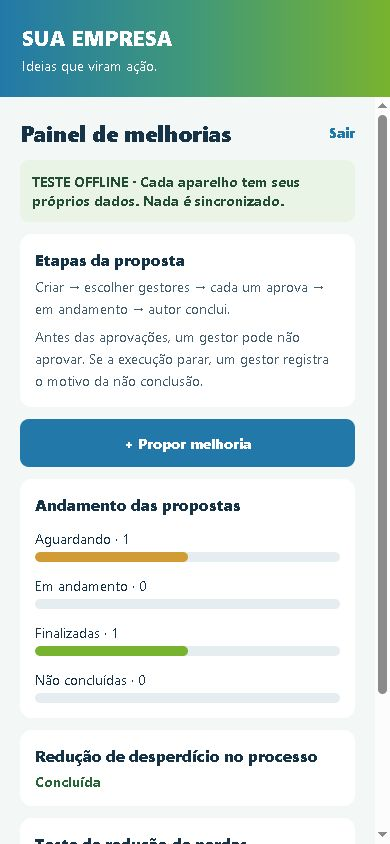 |

As imagens mostram a interface em tamanho de celular, mas não são capturas de um APK instalado no Android.

## Testar no computador

```bat
npm ci
set EXPO_PUBLIC_APP_MODE=offline
npm start
```

Para usar o modo conectado, copie `.env.example` para `.env`, preencha os valores Firebase e execute:

```bat
set EXPO_PUBLIC_APP_MODE=firebase
npm start
```

Para conferir o código:

```bat
npm run check
```

## Gerar um APK de demonstração no Windows

O APK deste passo a passo funciona **offline**: cada celular guarda seus próprios dados, sem sincronizar propostas com os outros. Para apresentar o app e conhecer as telas, não é necessário criar um Firebase.

**Para testar estas correções, use uma cópia atualizada do projeto.** Se você já clonou o repositório com Git, abra o CMD na pasta do projeto e rode `git pull origin main` antes de continuar. Se baixou um ZIP anteriormente, baixe um **novo ZIP** pelo GitHub e extraia-o em outra pasta; o ZIP antigo não recebe atualizações. Não rode o build na pasta antiga.

1. Instale o [Node.js](https://nodejs.org/) no computador e crie uma conta gratuita no [Expo](https://expo.dev/signup). Depois de instalar o Node.js, feche e abra o Prompt de Comando novamente.
2. Baixe este projeto pelo botão **Code → Download ZIP** no GitHub e extraia o ZIP. Abra a pasta extraída no Explorador de Arquivos, clique na barra de endereço, copie o caminho e use-o no comando abaixo. O caminho é só um exemplo: substitua pelo caminho real da sua pasta.
3. Abra o **Prompt de Comando (CMD)**. Não rode os comandos em `C:\Windows\System32`: primeiro entre na pasta que contém `package.json`.

```bat
cd /d "C:\Users\SEU_USUARIO\Downloads\AppMelhorias-main"
dir package.json
npm ci
```

Se `dir package.json` disser que o arquivo não existe, você ainda não está na pasta certa. Confira se o ZIP foi extraído e copie novamente o caminho da pasta onde aparece `package.json`.

4. Ainda **na mesma janela do CMD**, entre na sua conta Expo e vincule esta cópia do projeto à sua conta:

```bat
set EAS_NO_VCS=1
npx eas-cli login
npx eas-cli build:configure
```

Se o EAS perguntar qual conta será dona do projeto, escolha a **sua conta Expo**. Se pedir para criar ou vincular um projeto, confirme a criação na sua conta. No primeiro build, ele também pode perguntar sobre a chave de assinatura do Android; para uma demonstração nova, aceite a opção de gerar uma chave.

5. Gere o APK:

```bat
npx eas-cli build --platform android --profile offline
```

O serviço mostrará um link para acompanhar o andamento. Quando terminar, abra esse link, baixe o arquivo **`.apk`**, envie-o para o celular Android e abra o arquivo no aparelho para instalar. O Android pode pedir autorização para instalar aplicativos dessa origem; conceda-a apenas se você reconhece o APK que acabou de gerar. A geração acontece na nuvem e pode demorar alguns minutos. Não é preciso deixar o Node.js aberto depois que o APK estiver instalado.

Esta atualização usa a versão **2.0.1 (código Android 7)**. Se um APK anterior estiver instalado, tente instalar o novo por cima. Se o Android disser que o aplicativo não pode ser atualizado, a assinatura ou o identificador do app pode ser diferente. Nesse caso, não desinstale o antigo sem antes conferir se há propostas offline que você queira guardar: os dados locais podem ser perdidos na desinstalação.

**Importante:** se você fechar a janela do Prompt de Comando, a variável `EAS_NO_VCS=1` é apagada. Caso abra um CMD novo para continuar depois, entre novamente na pasta do projeto e digite `set EAS_NO_VCS=1` antes de rodar os comandos do EAS. Se aparecer `Run this command inside a project directory`, o CMD está na pasta errada; volte ao passo 3. Se surgir um erro relacionado a Git, confira se executou `set EAS_NO_VCS=1` nessa mesma janela.

Para abrir o app offline, use os acessos de demonstração descritos em [Modos disponíveis](#modos-disponíveis). Essas senhas não devem ser usadas na versão de uma empresa.

### APK conectado para teste na empresa

Esta etapa depende da configuração feita pela TI no [guia de implantação](docs/IMPLANTACAO-FIREBASE.md). Depois de criar o Firebase, as contas, as regras e as variáveis `EXPO_PUBLIC_FIREBASE_*` no ambiente `preview` do EAS, rode, na pasta do projeto:

```bat
set EAS_NO_VCS=1
npx eas-cli build --platform android --profile preview
```

O perfil `production` gera um **AAB** para a loja, não um APK para instalar diretamente no celular. O APK de teste não se atualiza sozinho nos aparelhos: a empresa precisa planejar como distribuir novas versões.

## Firebase

O guia de implantação está em [docs/IMPLANTACAO-FIREBASE.md](docs/IMPLANTACAO-FIREBASE.md). Ele orienta a criação do projeto, contas de usuários, perfis, regras, testes e distribuição.

O código traz o fluxo atualizado, mas a instalação conectada não fica pronta apenas ao baixar o repositório. A empresa precisa configurar seu projeto Firebase, criar as contas, publicar as regras, vincular a própria conta Expo/EAS, gerar o APK e validar o funcionamento em aparelhos reais. Contas corporativas existentes não entram automaticamente: a versão atual utiliza o login de e-mail e senha do Firebase.

Antes de distribuir, troque o nome, o identificador Android e os arquivos de `assets/` pelos materiais aprovados pela empresa. O ícone atual é apenas um exemplo visual e não concede direito de uso de marcas de terceiros.


