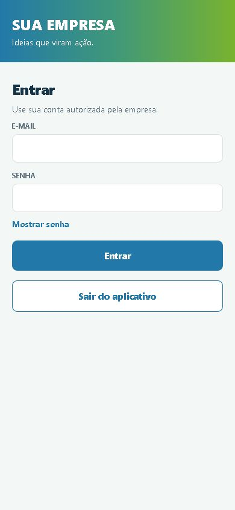
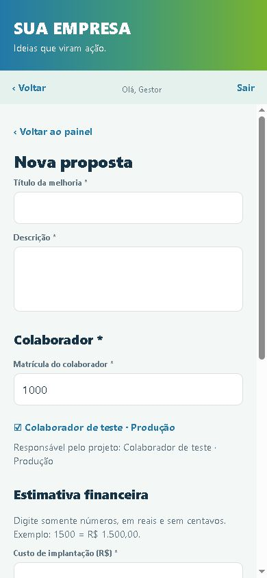

# Testar o aplicativo com Firebase local

Este teste simula a versão conectada sem usar a conta Firebase da empresa. O computador roda dois emuladores: **Authentication** para as contas e **Firestore** para propostas, aprovações e histórico. Os dados de teste não são enviados para a nuvem. O aplicativo offline continua disponível separadamente.



No cadastro conectado, o responsável é escolhido pela matrícula do colaborador. O nome e o setor vêm do perfil cadastrado pela TI.



## Preparar uma vez

1. Instale o [Node.js](https://nodejs.org/) e o [Java 21](https://learn.microsoft.com/java/openjdk/download) se ainda não estiverem no computador. O Firebase CLI já faz parte das dependências deste projeto; não é necessário criar uma conta Google para os emuladores.
2. Abra o CMD na pasta do projeto, onde está `package.json`, e rode `npm ci`.
3. Crie um arquivo chamado `.env.local` nessa pasta com estas duas linhas:

   ```text
   EXPO_PUBLIC_APP_MODE=firebase
   EXPO_PUBLIC_FIREBASE_EMULATOR=true
   ```

   Esse arquivo fica somente no computador e não deve ser publicado no GitHub. O modo local usa um projeto fictício chamado `demo-app-melhorias-local`; não coloque nele as configurações de um Firebase real.

## Abrir a demonstração

Use três janelas do CMD, todas abertas na pasta do projeto:

1. Na primeira, execute `scripts\start-firebase-local.cmd`. Deixe essa janela aberta. Os emuladores estarão em `127.0.0.1:9099` (contas) e `127.0.0.1:8080` (dados); o painel de administração ficará em [http://127.0.0.1:4000](http://127.0.0.1:4000). O script também aceita uma instalação normal de Java disponível no PATH.
2. Na segunda, execute `npm run seed:emulator`. Isso cria quatro contas **fictícias**, sem criar propostas. Se executar outra vez, ele reaproveita as mesmas contas.
3. Na terceira, execute `npx expo start --web`. Abra o endereço local informado pelo Expo para acessar a tela de login.

| Perfil | E-mail de teste | Senha | Matrícula |
| --- | --- | --- | --- |
| Colaborador | `colaborador@demo.local` | `000000` | `1000` |
| Gestor da área | `gestor.area@demo.local` | `111111` | `2000` |
| Gestor da manutenção | `gestor.manutencao@demo.local` | `222222` | `3000` |
| Gestor de custos | `gestor.custos@demo.local` | `333333` | `4000` |

Entre primeiro como colaborador e crie uma proposta. No campo **Matrícula do colaborador**, informe `1000` e selecione o perfil encontrado. Saia e entre como gestor para escolher os aprovadores pelas matrículas `2000`, `3000` ou `4000`. Cada gestor entra com a própria conta e aprova sua etapa; depois da última aprovação, a proposta passa a **Em andamento**. Ao entrar novamente como autor, você poderá concluí-la. Use o painel do emulador para conferir contas, documentos e histórico.

Para observar a sincronização ao vivo, abra o app em duas janelas com perfis de navegador separados no mesmo computador. Entre como colaborador em uma e como gestor na outra; a proposta e as decisões devem aparecer nas duas sem recarregar a página.

## O que este teste não faz

- Os emuladores só atendem o próprio computador (`127.0.0.1`). Um APK em outro celular não consegue acessar essa instalação. Para vários aparelhos reais, a empresa precisará de um projeto Firebase próprio ou de um ambiente de testes online aprovado pela TI.
- As senhas acima são apenas para esta simulação; nunca as use em produção. Não coloque dados reais de funcionários ou propostas neste ambiente.
- Os dados dos emuladores se perdem ao encerrá-los, a menos que você configure uma exportação local. Este passo a passo não publica regras nem cria recursos na nuvem.
- O login corporativo por matrícula e senha ainda exige integração com a TI. Aqui o acesso conectado continua por e-mail e senha, como na versão Firebase atual do app.
- Antes de preparar um APK conectado à nuvem, remova `EXPO_PUBLIC_FIREBASE_EMULATOR=true` do ambiente de build e confira as variáveis do projeto Firebase correto. Caso contrário, o app tentará falar com os emuladores locais.

Para voltar à demonstração sem Firebase, encerre o Expo, altere `EXPO_PUBLIC_APP_MODE` para `offline` no `.env.local` e inicie o Expo novamente. O [guia de implantação](IMPLANTACAO-FIREBASE.md) descreve o que falta para uso real na empresa.
